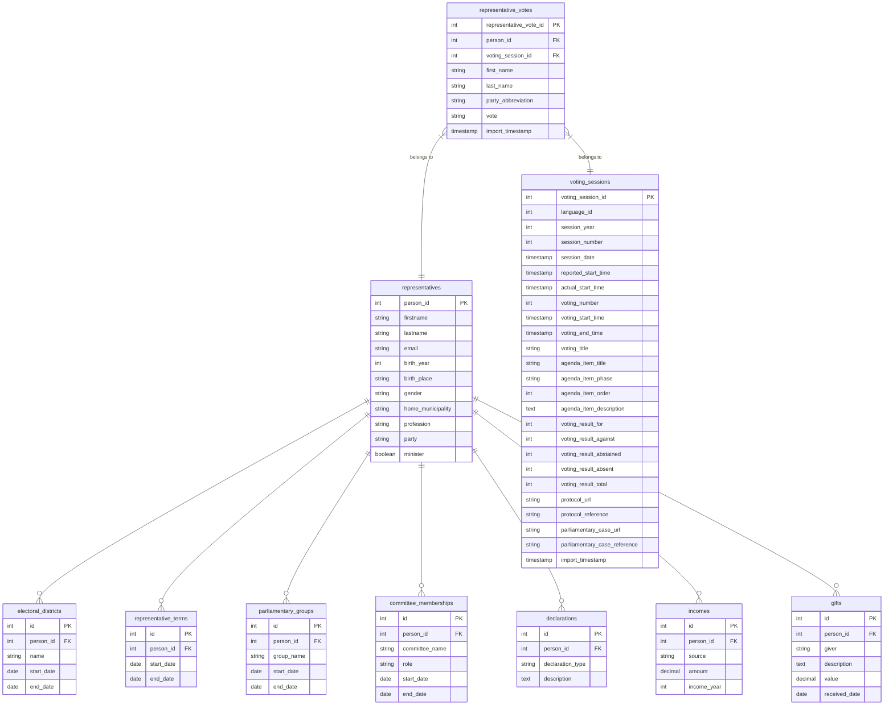

# Eduskunta forum

```mermaid
erDiagram
    representatives {
        int person_id PK
        string firstname
        string lastname
        string email
        int birth_year
        string birth_place
        string gender
        string home_municipality
        string profession
        string party
        boolean minister
    }

    electoral_districts {
        int id PK
        int person_id FK
        string name
        date start_date
        date end_date
    }

    representative_terms {
        int id PK
        int person_id FK
        date start_date
        date end_date
    }

    parliamentary_groups {
        int id PK
        int person_id FK
        string group_name
        date start_date
        date end_date
    }

    committee_memberships {
        int id PK
        int person_id FK
        string committee_name
        string role
        date start_date
        date end_date
    }

    declarations {
        int id PK
        int person_id FK
        string declaration_type
        text description
    }

    incomes {
        int id PK
        int person_id FK
        string source
        decimal amount
        int income_year
    }

    gifts {
        int id PK
        int person_id FK
        string giver
        text description
        decimal value
        date received_date
    }

    representatives ||--o{ electoral_districts : ""
    representatives ||--o{ representative_terms : ""
    representatives ||--o{ parliamentary_groups : ""
    representatives ||--o{ committee_memberships : ""
    representatives ||--o{ declarations : ""
    representatives ||--o{ incomes : ""
    representatives ||--o{ gifts : ""

    representative_votes {
        int representative_vote_id PK
        int person_id FK
        int voting_session_id FK
        string first_name
        string last_name
        string party_abbreviation
        string vote
        timestamp import_timestamp
    }

    voting_sessions {
        int voting_session_id PK
        int language_id
        int session_year
        int session_number
        timestamp session_date
        timestamp reported_start_time
        timestamp actual_start_time
        int voting_number
        timestamp voting_start_time
        timestamp voting_end_time
        string voting_title
        string agenda_item_title
        string agenda_item_phase
        int agenda_item_order
        text agenda_item_description
        int voting_result_for
        int voting_result_against
        int voting_result_abstained
        int voting_result_absent
        int voting_result_total
        string protocol_url
        string protocol_reference
        string parliamentary_case_url
        string parliamentary_case_reference
        timestamp import_timestamp
    }

    representative_votes }|--|| voting_sessions: "belongs to"
    representative_votes }|--|| representatives: "belongs to"
```
