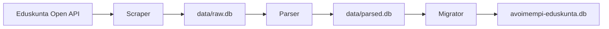

# Eduskuntapeili

Data aggregation and analysis platform for Finnish Parliament (Eduskunta) data.

The project ingests source data from the Eduskunta Open API, transforms it through a three-stage pipeline, imports it into SQLite, and serves it through a Bun + React web app.

## Requirements

- `bun` v1.2.2
- `podman` or `docker` (optional, for containerized workflows)

## Monorepo structure

```txt
packages/
├── client/      React frontend (Material UI)
├── server/      Bun HTTP API + database access
├── datapipe/    Scraper, parser, and migrator CLIs
└── shared/      Shared constants, types, storage, and DB utilities

data/
├── raw.db       Raw rows from scraper
└── parsed.db    Parsed rows from parser

avoimempi-eduskunta.db         Final application SQLite database
avoimempi-eduskunta-trace.db   Import/source-reference trace database
```

## Quick start

```bash
bun install
cp .env.example .env
bun run start
```

In development mode (`bun run start`), the server runs on `http://localhost:3000` by default.

## Data pipeline


```mermaid
flowchart LR
  A[Eduskunta Open API] --> B[Scraper]
  B --> C[data/raw.db]
  C --> D[Parser]
  D --> E[data/parsed.db]
  E --> F[Migrator]
  F --> G[avoimempi-eduskunta.db]
```

### 1) Fetching (`scrape`)

Command:

```bash
bun run scrape <TableName>
```

What it does:

- reads table metadata from `/columns`
- fetches rows from `/batch` using PK-based pagination
- writes to `data/raw.db` through row-store abstraction
- auto-resumes from the highest stored PK
- supports targeted repair/range runs (`--from-pk`, `--to-pk`, `--single-pk`, `--patch-pk`)

Status command:

```bash
bun run scrape status
```

### 2) Parsing (`parse`)

Command:

```bash
bun run parse <TableName>
```

What it does:

- reads raw rows from `data/raw.db`
- reconstructs row objects from stored column schema
- applies optional per-table parser from `packages/datapipe/parser/fn/<TableName>.ts`
- writes normalized rows to `data/parsed.db`
- skips unchanged rows by hash by default (`--force` to reparse)

Status command:

```bash
bun run parse status
```

Parse all known tables:

```bash
bun run parse all
```

### 3) Migrating to app DB (`migrate`)

Command:

```bash
bun run migrate
```

What it does:

- opens/creates `avoimempi-eduskunta.db`
- applies SQL migrations from `packages/datapipe/migrator/migrations`
- clears import target tables
- imports parsed data in dependency-aware order using table migrators
- writes migration metadata and trace/source-reference data to `avoimempi-eduskunta-trace.db`
- publishes latest SQLite artifact metadata to storage

Status command:

```bash
bun run migrate status
```

Fresh rebuild (deletes DB files first, then imports):

```bash
bun run migrate:fresh
```

## Typical workflows

### Single-table development loop

```bash
bun run scrape MemberOfParliament
bun run parse MemberOfParliament
bun run migrate
```

### Refreshing a targeted PK range

```bash
bun run scrape MemberOfParliament --from-pk 82000 --to-pk 83000
bun run parse MemberOfParliament --pk-start 82000 --pk-end 83000
bun run migrate
```

### Manual terminal runbook

For a clear manual `sync -> parse -> rebuild` guide, see [packages/datapipe/README.md](./packages/datapipe/README.md#manual-sync-and-rebuild-runbook).

## Development commands

```bash
# Start server in development mode
bun run start

# Type checking
bun run typecheck

# Tests
bun run test

# Linting
bun run lint
bun run lint:fix

# Benchmarks
bun run bench:sql
bun run bench:http

# API coverage sanity helper
bun run check:table-coverage
```

## Configuration highlights

Copy `.env.example` and adjust only what you need.

Common variables:

- `STORAGE_PROVIDER` (`local` by default)
- `STORAGE_LOCAL_DIR` (defaults to `./data`)
- `SERVER_DB_LAUNCH_MODE` (`local`, `latest`, or `storage-key`)
- `DB_PATH` and `TRACE_DB_PATH` for custom DB file locations
- migrator tuning flags such as:
  - `MIGRATOR_SOURCE_REFERENCE_MODE`
  - `MIGRATOR_PUBLISH_SNAPSHOT`
  - `MIGRATOR_FOREIGN_KEY_CHECK`
  - `MIGRATOR_VACUUM_AFTER_IMPORT`

## Production deployment notes

For infrastructure/deploy review, production topology, and hardening checklist, see [PRODUCTION_SETUP.md](./PRODUCTION_SETUP.md).

## Notes

- Pipeline status is operationally tracked via CLI commands rather than a static README table.
- Schema evolves through SQL migrations in `packages/datapipe/migrator/migrations`.
- The README intentionally does not include a static ER diagram to avoid drift from the live schema.
