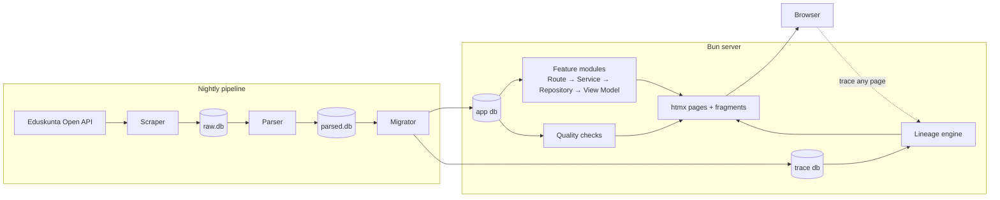

# Eduskuntapeili

**A Finnish Parliament data platform where every number on every page can be
traced to the exact official record that produced it — including the SQL in
between.**

Anyone can point an AI at an open government API and generate a dashboard.
The premise of this project is the opposite: nothing is asserted that cannot
be verified. Every page carries a live lineage trace — from the rendered view,
through the actual queries that fed it, down to the individual source records
on `avoindata.eduskunta.fi`, with per-row fetch timestamps. The proof resolves
to a domain I don't control.


*Click the trace button on any page → see the full lineage graph → inspect the
real SQL with its bound parameters → deep-link to the exact source record on
the official Eduskunta API. Storyboard for this recording:
[docs/trace-demo-storyboard.md](docs/trace-demo-storyboard.md).*

## Table of contents

- [Architecture](#architecture)
- [Monorepo structure](#monorepo-structure)
- [Requirements](#requirements)
- [Getting started](#getting-started)
- [Data pipeline](#data-pipeline)
  - [1. Fetching (`scrape`)](#1-fetching-scrape)
  - [2. Parsing (`parse`)](#2-parsing-parse)
  - [3. Migrating to app DB (`migrate`)](#3-migrating-to-app-db-migrate)
  - [Typical workflows](#typical-workflows)
- [Development](#development)
- [Configuration](#configuration)
- [Production deployment](#production-deployment)
- [Implementation notes](#implementation-notes)
- [Project metrics](#project-metrics)
- [Notes](#notes)

## Architecture


```mermaid
flowchart LR
  subgraph pipeline [Nightly pipeline]
    A[Eduskunta Open API] --> B[Scraper]
    B --> C[(raw.db)]
    C --> D[Parser]
    D --> E[(parsed.db)]
    E --> F[Migrator]
  end
  F --> G[(app db)]
  F --> T[(trace db)]
  subgraph server [Bun server]
    G --> H[Feature modules<br/>Route → Service → Repository → View Model]
    T --> I[Lineage engine]
    H --> J[htmx pages + fragments]
    I --> J
    Q[Quality checks] --> J
    G --> Q
  end
  J --> K[Browser]
  K -. trace any page .-> I
```

The server is organized by feature, not by layer: each screen owns its
routes, service, repository, co-located `.sql` files, view models, and
templates under [`packages/server/src/features/`](packages/server/src/features/).
The pipeline and the server never import each other's code; they share only
[`packages/shared/`](packages/shared/).

The lineage engine shown above is what powers the trace overlay in the demo.
SQL files are auto-parsed into a source registry at startup
([`src/database/query-provenance.ts`](packages/server/src/database/query-provenance.ts)).
Each page render records which queries fed it, with bounded overhead
([`src/database/trace-collector.ts`](packages/server/src/database/trace-collector.ts),
capped at 200 PKs / 400 rows per statement). A separate trace database built
during migration ([`migrator/trace-db.ts`](packages/datapipe/migrator/trace-db.ts))
supplies per-row scrape/migrate timestamps, and an htmx overlay renders the
resulting lineage graph ([`features/trace/`](packages/server/src/features/trace/)).

## Monorepo structure

```txt
packages/
├── server/      Bun HTTP server + htmx web app (feature modules under src/features/)
├── datapipe/    Scraper, parser, and migrator CLIs
├── shared/      Shared constants, types, storage, and DB utilities
└── infra/       Infrastructure-as-code (Terraform/OpenTofu)

data/
├── raw.db       Raw rows from scraper
└── parsed.db    Parsed rows from parser

avoimempi-eduskunta.db         Final application SQLite database
avoimempi-eduskunta-trace.db   Import/source-reference trace database
```

## Requirements

- [Bun](https://bun.sh) v1.2.2
- `podman` or `docker` (optional, for containerized workflows)

## Getting started

```bash
bun install
cp .env.example .env
bun run start
```

In development mode (`bun run start`), the server runs on `http://localhost:3000` by default.

## Data pipeline

The pipeline runs in three stages, in order: **scrape → parse → migrate**.

### 1. Fetching (`scrape`)

```bash
bun run scrape <TableName>
```

What it does:

- reads table metadata from `/columns`
- fetches rows from `/batch` using PK-based pagination
- writes to `data/raw.db` through the row-store abstraction
- auto-resumes from the highest stored PK
- supports targeted repair/range runs (`--from-pk`, `--to-pk`, `--single-pk`, `--patch-pk`)

Status command:

```bash
bun run scrape status
```

### 2. Parsing (`parse`)

```bash
bun run parse <TableName>
```

What it does:

- reads raw rows from `data/raw.db`
- reconstructs row objects from stored column schema
- applies an optional per-table parser from `packages/datapipe/parser/fn/<TableName>.ts`
- writes normalized rows to `data/parsed.db`
- skips unchanged rows by hash by default (`--force` to reparse)

Status command:

```bash
bun run parse status
```

Parse all known tables:

```bash
bun run parse all
```

### 3. Migrating to app DB (`migrate`)

```bash
bun run migrate
```

What it does:

- opens/creates `avoimempi-eduskunta.db`
- applies SQL migrations from `packages/datapipe/migrator/migrations`
- clears import target tables
- imports parsed data in dependency-aware order using table migrators
- writes migration metadata and trace/source-reference data to `avoimempi-eduskunta-trace.db`
- publishes latest SQLite artifact metadata to storage

Status command:

```bash
bun run migrate status
```

Fresh rebuild (deletes DB files first, then imports):

```bash
bun run migrate:fresh
```

### Typical workflows

**Single-table development loop:**

```bash
bun run scrape MemberOfParliament
bun run parse MemberOfParliament
bun run migrate
```

**Refreshing a targeted PK range:**

```bash
bun run scrape MemberOfParliament --from-pk 82000 --to-pk 83000
bun run parse MemberOfParliament --pk-start 82000 --pk-end 83000
bun run migrate
```

**Manual terminal runbook:** for a clear manual `sync -> parse -> rebuild` guide, see
[packages/datapipe/README.md](./packages/datapipe/README.md#manual-sync-and-rebuild-runbook).

## Development

```bash
# Start server in development mode
bun run start

# Type checking
bun run typecheck

# Tests
bun run test

# Linting
bun run lint
bun run lint:fix

# Benchmarks
bun run bench:sql
bun run bench:http

# API coverage sanity helper
bun run check:table-coverage
```

## Configuration

Copy `.env.example` and adjust only what you need.

Common variables:

- `STORAGE_PROVIDER` (`local` by default)
- `STORAGE_LOCAL_DIR` (defaults to `./data`)
- `SERVER_DB_LAUNCH_MODE` (`local`, `latest`, or `storage-key`)
- `DB_PATH` and `TRACE_DB_PATH` for custom DB file locations
- migrator tuning flags such as:
  - `MIGRATOR_SOURCE_REFERENCE_MODE`
  - `MIGRATOR_PUBLISH_SNAPSHOT`
  - `MIGRATOR_FOREIGN_KEY_CHECK`
  - `MIGRATOR_VACUUM_AFTER_IMPORT`

## Production deployment

For infrastructure/deploy review, production topology, and hardening checklist, see
[scripts/README.md](./scripts/README.md).

## Implementation notes

- **SQL contracts** — queries are checked compile-time via typed SQL
  contracts ([`sql-contract.test-d.ts`](packages/server/__tests__/sql-contract.test-d.ts)),
  runtime snapshot audits against the real schema, and a
  [sargability test](packages/server/__tests__/query-sargability.test.ts)
  that fails the build if a query can't use an index on the 8.6M-row vote table.

- **ETL** — the scraper resumes from the highest stored PK, repairs gaps,
  tracks upstream revisions with element-wise diffs, and retries with
  exponential backoff ([`datapipe/scraper/`](packages/datapipe/scraper/)).
  The parser skips unchanged rows by hash. The migrator runs `ANALYZE` and
  rebuilds the trace database on every import.

- **Quality checks** — a startup runner validates real-data invariants and
  serves a status page at `/laadunvalvonta`
  ([`features/quality/`](packages/server/src/features/quality/)).

- **JSX runtime** — the server-side JSX runtime escapes by default; raw HTML
  requires an explicit `trustedHtml()` marker
  ([`src/jsx/jsx-runtime.ts`](packages/server/src/jsx/jsx-runtime.ts)). CSP
  headers are applied and tested.

- **AI summaries** — on-page summaries run in the browser via the built-in
  Summarizer API ([`src/client/ai-summary-island.ts`](packages/server/src/client/ai-summary-island.ts));
  the server makes no LLM calls. Batch LLM analysis runs in the data pipeline
  ([`datapipe/llm/`](packages/datapipe/llm/)).

- **Runtime** — server-rendered htmx (the app was previously a React/MUI SPA
  and was rewritten), SQLite (WAL mode), single VM with atomic symlink-flip
  releases.

## Project metrics

As of June 2026, a single nightly pipeline imports and row-level-traces:

|            |                                                                             |
| ---------: | :-------------------------------------------------------------------------- |
| **10.0 M** | source rows imported, each with scrape + migrate provenance                 |
|  **8.6 M** | individual MP votes (`SaliDBAanestysEdustaja`)                              |
|  **412 k** | parliamentary documents (Vaski XML + EDK), parsed into typed document kinds |
|  **145 k** | plenary speeches                                                            |
|   **43 k** | plenary votings across 1.7 k sessions                                       |
|  **2 677** | MP records, past and present                                                |
|     **14** | source datasets from the Eduskunta Open Data API                            |
|  **~63 k** | lines of TypeScript, of which **~11 k** are tests                           |

Served by one Bun process over SQLite (WAL, read-only `query_only`
connection), on a single Hetzner VM with atomic symlink-flip releases.

## Notes

- Pipeline status is operationally tracked via CLI commands rather than a static README table.
- Schema evolves through SQL migrations in `packages/datapipe/migrator/migrations`.
- The README intentionally does not include a static ER diagram to avoid drift from the live schema.
