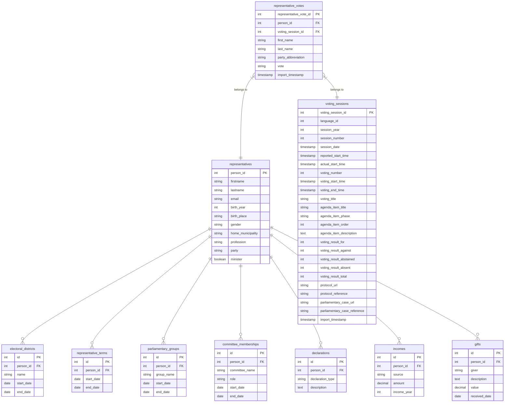

# Avoimempi Eduskunta (More Open Parliament)

Aggregate data from multiple open sources for analysis.

## Requirements

- **bun** v1.2.2
- **podman** or **docker**

## Project structure

TODO: Fix this!

```txt
# migration files
migrations/
└── *.sql
src/
│ # common constants and utils
├── common/
│   ├── constants/
│   └── types/
│ # code to fetch raw data
├── scraper/
│   ├── data/
│   │   └── <TableName>/
│   │       └── page-*.json
│   ├── fn/
│   │   └── <TableName>.mts
│   └── scrape-table.mts
│ # code to import parsed data
├── migrator/
│   ├── <TableName>/
│   │   ├── migrator.mts
│   │   ├── model.mts
│   │   └── schema.json
│   └── import-data.mts
│ # code to parse fetched raw data
├── parser/
│   ├── data/
│   │   └── <TableName>/
│   │       └── *.json
│   ├── fn/
│   │   └── <TableName>.mts
│   └── parse-data.mts
│ # other random scripts and transformation files
└── scripts/
```

## Data import status

Status of data import.

| source | name                    | description                             | status    | info            |
| ------ | ----------------------- | --------------------------------------- | --------- | --------------- |
| API    | Attachment              | TBD                                     | unstarted |
| API    | AttachmentGroup         | TBD                                     | unstarted |
| API    | HetekaData              | TBD                                     | unstarted |
| API    | MemberOfParliament      | Representatives and their related data. | imported  | partial support |
| API    | PrimaryKeys             | TBD                                     | unstarted |
| API    | SaliDBAanestys          | Voting sessions in parliament.          | parsed    |
| API    | SaliDBAanestysAsiakirja | TBD                                     | unstarted |
| API    | SaliDBAanestysEdustaja  | Votes by representatives.               | parsed    |
| API    | SaliDBAanestysJakauma   | TBD                                     | unstarted |
| API    | SaliDBAanestysKieli     | TBD                                     | unstarted |
| API    | SaliDBIstunto           | TBD                                     | unstarted |
| API    | SaliDBKohta             | TBD                                     | unstarted |
| API    | SaliDBKohtaAanestys     | TBD                                     | unstarted |
| API    | SaliDBKohtaAsiakirja    | TBD                                     | unstarted |
| API    | SaliDBMessageLog        | TBD                                     | unstarted |
| API    | SaliDBPuheenvuoro       | TBD                                     | unstarted |
| API    | SaliDBTiedote           | TBD                                     | unstarted |
| API    | SeatingOfParliament     | TBD                                     | unstarted |
| API    | VaskiData               | TBD                                     | unstarted |

## Database ER diagram

The imported data is transformed into the the following tables.


