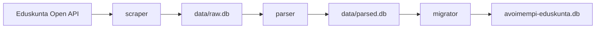

# Eduskunta Data Pipeline

`packages/datapipe` contains the three ETL stages used to build the application database:

1. `scraper`: fetches source rows from Eduskunta Open API into `data/raw.db`
2. `parser`: transforms raw rows into normalized rows in `data/parsed.db`
3. `migrator`: imports parsed rows into `avoimempi-eduskunta.db`

## Pipeline flow



## Directory structure

```txt
packages/datapipe/
├── scraper/
│   ├── cli.ts
│   └── scraper.ts
├── parser/
│   ├── cli.ts
│   ├── parser.ts
│   └── fn/<TableName>.ts
└── migrator/
    ├── cli.ts
    ├── migrations/V*.sql
    └── <TableName>/migrator.ts
```

## Running commands

From repository root:

```bash
bun run scrape <TableName>
bun run parse <TableName>
bun run migrate
```

Equivalent direct commands from `packages/datapipe`:

```bash
bun run scraper/cli.ts <TableName>
bun run parser/cli.ts <TableName>
bun run migrator/cli.ts start
```

## Stage details

### 1) Scraper

Reads table columns and paginated batches from:

- `https://avoindata.eduskunta.fi/api/v1/tables/<TableName>/columns`
- `https://avoindata.eduskunta.fi/api/v1/tables/<TableName>/batch`

Writes to row-store `data/raw.db` using PK-based upserts and resume logic.

Common commands:

```bash
# auto-resume
bun run scrape MemberOfParliament

# start from PK
bun run scrape MemberOfParliament --from-pk 500

# scrape inclusive PK range
bun run scrape MemberOfParliament --from-pk 82000 --to-pk 83000

# refresh one PK
bun run scrape MemberOfParliament --single-pk 82310

# patch from PK (patch page + one follow-up page)
bun run scrape MemberOfParliament --patch-pk 82310

# status
bun run scrape status
```

Notes:

- default batch size is up to 100 rows per request
- auto-resume continues from max stored PK for the table
- gap repair is attempted automatically in auto-resume/full runs

### 2) Parser

Reads rows from `data/raw.db`, reconstructs typed row objects from stored column schema, applies optional custom parser logic, then writes to `data/parsed.db`.

Common commands:

```bash
# parse one table
bun run parse MemberOfParliament

# parse all known tables
bun run parse all

# force re-parse (ignore hash-based skip)
bun run parse MemberOfParliament --force

# parse PK range
bun run parse MemberOfParliament --pk-start 82000 --pk-end 83000

# status
bun run parse status
```

Custom parser modules:

- location: `packages/datapipe/parser/fn/<TableName>.ts`
- default export: async parser function `(row, primaryKey) => [id, transformedRow]`

### 3) Migrator

Rebuilds/imports the app database from parsed rows.

Core behavior:

- opens/creates target DB (`avoimempi-eduskunta.db`)
- applies SQL migrations from `packages/datapipe/migrator/migrations`
- clears import target tables
- imports tables in dependency-aware order via table migrators
- updates migration metadata
- writes import trace/source-reference data (`avoimempi-eduskunta-trace.db`)
- publishes latest SQLite artifact metadata to storage

Common commands:

```bash
# default (same as "start")
bun run migrate

# explicit
bun run migrate start

# status
bun run migrate status

# fresh recreate (deletes DB files first, then imports)
bun run migrate:fresh
```

## End-to-end examples

Single table:

```bash
bun run scrape MemberOfParliament
bun run parse MemberOfParliament
bun run migrate
```

Targeted repair:

```bash
bun run scrape MemberOfParliament --from-pk 82000 --to-pk 83000
bun run parse MemberOfParliament --pk-start 82000 --pk-end 83000
bun run migrate
```

## Configuration

Key environment variables:

- `ROW_STORE_DIR`: directory containing `raw.db` and `parsed.db`
- `STORAGE_LOCAL_DIR`: fallback base dir used when `ROW_STORE_DIR` is not set
- `DB_PATH`: override final app DB path
- `TRACE_DB_PATH`: override trace DB path
- `MIGRATOR_*`: migration tuning and reporting flags (see root `.env.example`)

## See also

- Root overview: `../../README.md`
- Parser details: `./parser/README.md`
- Shared storage docs: `../shared/storage/README.md`
