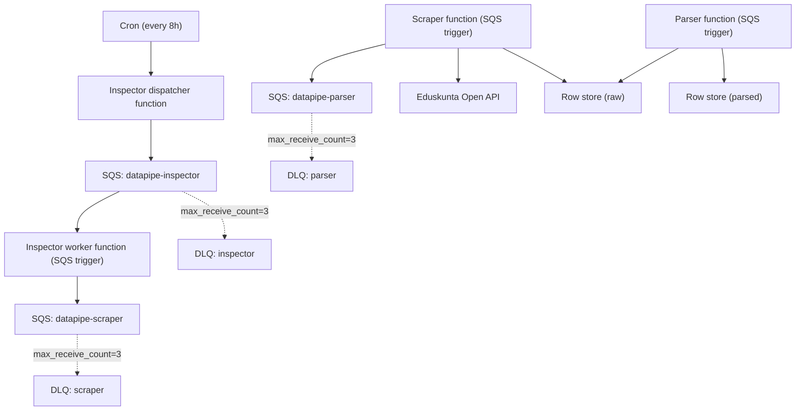

# Scaleway Infra (Bucket + SQS Queues + Optional Cloud Functions)

This folder provisions:

- one hardcoded Scaleway Object Storage bucket for pipeline data
- Scaleway Queues (SQS API) resources for datapipe orchestration
- optional serverless functions + triggers for inspector/scraper/parser/migrator

## What it creates

- Bucket: `bkt-avoimempi-eduskunta-pipeline`
- Region: `nl-ams`
- ACL: `private` (not public)
- Queues service activation (`scaleway_mnq_sqs`)
- SQS credentials for:
  - queue provisioning (manage-only)
  - inspector dispatcher (publish-only)
  - queue workers (receive+publish)
- Three SQS queues:
  - `datapipe-inspector`
  - `datapipe-scraper`
  - `datapipe-parser`
- Logical prefixes used by the app:
  - `raw/`
  - `parsed/`
  - `metadata/`
  - `artifacts/`
- Optional serverless functions (behind `enable_cloud_functions`):
  - inspector dispatcher function (cron every 8h) enqueues inspect tasks
  - inspector worker function triggered from `datapipe-inspector` queue
  - scraper function triggered from `datapipe-scraper` queue
  - parser function triggered from `datapipe-parser` queue
  - migrator function (manual trigger; only created when `pipeline_migrator_zip_file` is set)
  - queue failures are retried and then sent to DLQ after `max_receive_count = 3`

Note: S3-compatible storage does not require explicit folder resources. Prefixes appear automatically when objects are written.

## Usage

Optional (recommended) override for project ID used for queue resources:

```bash
export TF_VAR_project_id="<your-scaleway-project-id>"
```

Enable cloud functions and point to function zip artifacts (built separately):

```bash
export TF_VAR_enable_cloud_functions=true
export TF_VAR_pipeline_inspector_zip_file="/absolute/path/to/inspector.zip"
export TF_VAR_pipeline_inspector_worker_zip_file="/absolute/path/to/inspector-worker.zip"
export TF_VAR_pipeline_scraper_zip_file="/absolute/path/to/scraper.zip"
export TF_VAR_pipeline_parser_zip_file="/absolute/path/to/parser.zip"
export TF_VAR_pipeline_migrator_zip_file="/absolute/path/to/migrator.zip" # optional
```

Then run:

```bash
cd packages/infra
tofu init
tofu plan
tofu apply
```

If `TF_VAR_project_id` is omitted, the provider default project configuration is used.

## Useful outputs

After apply, inspect outputs:

```bash
tofu output pipeline_queue_names
tofu output pipeline_queue_urls
tofu output pipeline_queue_env_template
tofu output -json pipeline_sqs_credentials_inspector
tofu output -json pipeline_sqs_credentials_worker
tofu output cloud_function_namespace
tofu output cloud_functions
```

`pipeline_sqs_credentials_inspector` and `pipeline_sqs_credentials_worker` are marked sensitive and contain:

- `PIPELINE_SQS_ACCESS_KEY_ID`
- `PIPELINE_SQS_SECRET_ACCESS_KEY`

## Data update lifecycle (functions)



Function behavior constraints:

- Every function has finite timeout (`300s`, migrator `1800s`).
- Queue workers are event-driven, not infinite polling loops.
- Retries are bounded by SQS redrive policy and end in DLQ.

## Upload existing local data

After bucket creation, sync local pipeline folders:

```bash
cp .env.sync-storage-s3.example .env.sync-storage-s3
bun --env-file=.env.sync-storage-s3 run sync:storage:s3 --dry-run
bun --env-file=.env.sync-storage-s3 run sync:storage:s3
```

Defaults to uploading `data/raw` and `data/parsed`, and row-store DB backups (`raw.db`, `parsed.db`) to `artifacts/row-store/latest/`.
Use `--all` to include `metadata` and `artifacts`:

```bash
bun --env-file=.env.sync-storage-s3 run sync:storage:s3 --all
```

Optional: also write timestamped row-store DB snapshots:

```bash
bun --env-file=.env.sync-storage-s3 run sync:storage:s3 --snapshot-row-store-dbs
```

## Local requirements for sync script

`bun run sync:storage:s3` requires:

- Bun installed (repo runtime)
- AWS CLI installed (`aws` command) for S3-compatible sync operations
- Network access to `https://s3.nl-ams.scw.cloud`
- A filled `.env.sync-storage-s3` file with:
  - `STORAGE_S3_BUCKET`
  - `STORAGE_S3_REGION`
  - `STORAGE_S3_ENDPOINT`
  - credentials via one of:
    - `STORAGE_S3_ACCESS_KEY_ID` + `STORAGE_S3_SECRET_ACCESS_KEY`
    - `SCW_ACCESS_KEY` + `SCW_SECRET_KEY`
    - `SCW_PROFILE` (requires `scw` CLI installed and profile configured)

Quick checks:

```bash
command -v bun
command -v aws
```

If using `SCW_PROFILE`:

```bash
command -v scw
scw config get access-key
```

## If bucket name is taken

Edit `packages/infra/main.tf` and change `scaleway_object_bucket.pipeline.name`.
